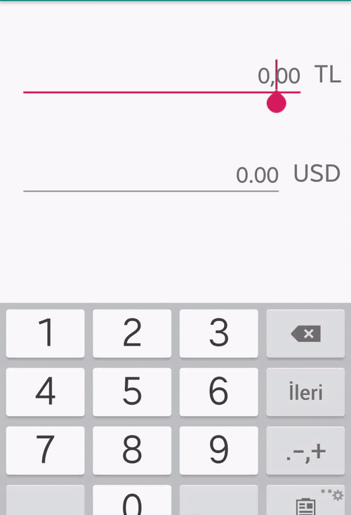

# CurrencyEdittext
Android edittext currency mask library.

By inserting additional properties into the  [BlacKCaT27](https://github.com/BlacKCaT27/CurrencyEditText) library, the cursor remains fixed, and the cursor will no longer return to the beginning. The cursor will continue to stay where it is until you change it.

The cursor will move to decimal part when you click to comma.

# Gif



# Setup

* **Grade**  
Add it as a dependency to your `build.gradle`

```gradle

allprojects {
    repositories {
        google()
        jcenter()
        maven { url 'https://jitpack.io' }
    }
}
```

```gradle

dependencies {
      implementation 'com.github.umutsoysl:CurrencyEdittext:1.0.1'
}
	
```
# Using

* **You can use the library by adding to the XML side of your project.**

```xml

 <com.umut.soysal.lib.CurrencyEditText
            android:layout_width="match_parent"
            android:layout_height="wrap_content"
	    android:id="@+id/currencyEn"		       
            tools:ignore="MissingConstraints"/>

```


* **You can choose any locale.**

```kotlin
/*
set currency usd
*/
currencyEn.locale = Locale.US
	
```
License
--------


    Copyright 2019 Umut Soysal.

    Licensed under the Apache License, Version 2.0 (the "License");
    you may not use this file except in compliance with the License.
    You may obtain a copy of the License at

       http://www.apache.org/licenses/LICENSE-2.0

    Unless required by applicable law or agreed to in writing, software
    distributed under the License is distributed on an "AS IS" BASIS,
    WITHOUT WARRANTIES OR CONDITIONS OF ANY KIND, either express or implied.
    See the License for the specific language governing permissions and
    limitations under the License.
